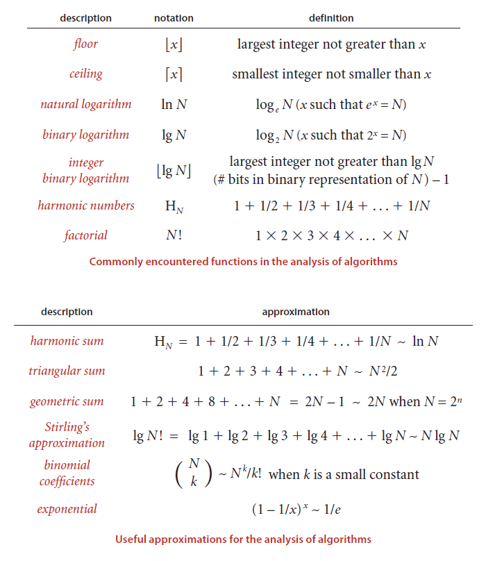

#Algorithm
`big O: an upper bound (The worst case). It won't be slower than runtimes.` 
`big omega: an lower bound (The best case). It won't be faster than those runtimes.` 
`big theta: both O and omega. An algorithm is 0(N) if it is both Big O(N) and Big omega(N). 0 gives a tight bound on runtime.` 

<h4>In industry, People merge Big theta and Big O together. Industry's meaning of big O is <strong>big theta</strong></h4>

